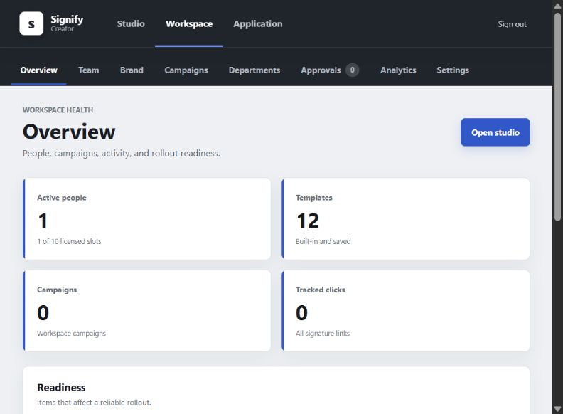
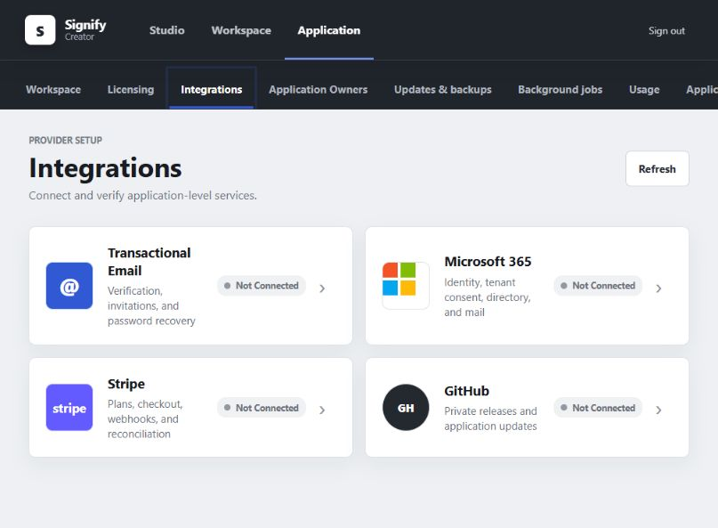

# Signify Creator

**Create, manage, and deploy professional email signatures from one self-hosted web application.**

[Documentation](https://ithealthtech.github.io/Signify-Suite/) | [Latest release](https://github.com/ithealthtech/Signify-Suite/releases/latest) | [Installation help](#installation) | [Report a problem](https://github.com/ithealthtech/Signify-Suite/issues)

Signify Creator gives organizations a visual signature editor, reusable templates,
campaign banners, approvals, Microsoft 365 delivery, analytics, and centralized
management. It runs on your own Node.js hosting, so your organization controls the
application and its data.


## What You Get

- A visual email signature editor with Outlook-friendly output
- Reusable templates, branding, QR codes, vCards, and campaign banners
- Three access levels: Application Owner, Tenant Admin, and End User
- Microsoft 365 tenant connections and managed signature delivery
- User management, direct user creation, invitations, and approvals
- Trial and subscription controls managed by the Application Owner
- GitHub release checks and one-click updates on supported hosts
- Built-in backups, restore tools, audit history, health checks, and usage reports
- Responsive pages for desktop, tablet, and mobile browsers

### Workspace Management

See user capacity, templates, campaigns, tracked clicks, and rollout readiness in
one workspace view.



### Simple Integration Setup

Application Owners connect each optional service from a focused integration
gallery instead of working through one long settings page.



## Editions

### Community Edition

Every new installation starts in Community Edition. No license key is required.

- One workspace
- Up to 10 users
- Signature editor, templates, campaigns, and normal workspace management
- No additional tenant creation

The single tenant page becomes the settings area for the organization that owns
the installation.

### Licensed Edition

A commercial license can unlock additional tenants, users, and licensed features.
The license is entered in **Application > Licensing**. No command-line work is
required. If a license expires or is revoked, existing data remains available and
the installation returns to its allowed Community limits.

## Before You Install

You need:

- Node.js 22.13 or newer. Node.js 24 LTS is recommended.
- npm 10 or newer
- A domain with HTTPS for production use
- A persistent folder that is not erased when the app restarts or updates
- An email address for the first Application Owner

Microsoft 365, Stripe, transactional email, and GitHub are optional during setup.
They can be connected later from **Application > Integrations**.

> Signify currently uses SQLite and supports one application server and one worker
> on a single host. Do not run multiple application replicas yet.

## Installation

Choose the method that matches your hosting.

### Option 1: Node.js Web Hosting

This is the simplest choice for Hostinger and similar Node.js hosting panels.

1. Download the source archive from the
   [latest release](https://github.com/ithealthtech/Signify-Suite/releases/latest)
   or upload the repository files to your host.
2. Set the Node.js version to **24.x**.
3. Set the entry file to **`server.cjs`**.
4. Set the build command to **`npm run build`** when the host asks for one.
5. Add the required settings shown below.
6. Start the application and visit **`https://your-domain.example/setup.html`**.

Use these starting settings in the hosting control panel:

```env
NODE_ENV=production
HOST=0.0.0.0
PORT=4173
TRUST_PROXY=true

DATABASE_PATH=/persistent/signify/data/signify-creator.db
BACKUP_DIR=/persistent/signify/backups

SIGNIFY_PUBLIC_URL=https://signatures.example.com
SIGNIFY_ASSET_BASE_URL=https://signatures.example.com
SIGNIFY_MEDIA_BASE_URL=https://signatures.example.com
SIGNIFY_COMPANY_NAME=Example Company
SIGNIFY_APPLICATION_OWNER_EMAIL=owner@example.com

SIGNATURE_ALLOW_DEFAULT_ADMIN=false
SIGNIFY_REQUIRE_OWNER_MFA=true
SIGNIFY_CREDENTIAL_ENCRYPTION_KEY=PASTE_GENERATED_KEY_HERE
SIGNIFY_SETUP_TOKEN=PASTE_GENERATED_SETUP_TOKEN_HERE
```

Replace the example domain, company, email, and storage paths. Your hosting
provider may assign the `PORT` value automatically. Use the assigned value when it
does.

Generate the two protected values on any computer with Node.js installed:

```bash
node -e "console.log(require('node:crypto').randomBytes(32).toString('base64'))"
node -e "console.log(require('node:crypto').randomBytes(32).toString('base64url'))"
```

Use the first result for `SIGNIFY_CREDENTIAL_ENCRYPTION_KEY` and the second for
`SIGNIFY_SETUP_TOKEN`. Store the encryption key safely. Do not replace it during
an update.

After setup succeeds, remove `SIGNIFY_SETUP_TOKEN` from the hosting panel and
restart the application.

#### Hostinger Settings

| Hostinger field  | Value           |
| ---------------- | --------------- |
| Node.js version  | `24.x`          |
| Framework        | `Other`         |
| Build command    | `npm run build` |
| Output directory | `dist`          |
| Entry file       | `server.cjs`    |

Confirm that Hostinger preserves the database, uploads, generated banners, and
backup folders when the application is redeployed. Use a VPS if the selected plan
does not provide persistent storage.

### Option 2: Interactive Node.js Installer

Use this method when you have terminal access to the server.

```bash
npm ci --omit=dev
npm run setup
npm start
```

The installer detects the application folder, server address, database location,
backup location, and public domain when the host provides them. It asks only for
missing information, creates the first Application Owner, applies database
updates, and displays the first login password.

Store the displayed password immediately. It is shown only during a fresh
installation.

### Option 3: Docker Compose

Docker is recommended when you control the server or VPS.

```bash
cp .env.container.example .env.container
docker compose build
docker compose run --rm setup
docker compose run --rm migrate
docker compose up -d web worker
docker compose exec web node scripts/doctor.cjs
```

Before starting, edit `.env.container` and replace the example domain, company,
owner email, and encryption key. The setup command prints the first login
password.

### Local Test Installation

Use this only for testing on your computer:

```bash
npm ci
npm run setup
npm run dev
```

Open [http://127.0.0.1:4173](http://127.0.0.1:4173).

## First-Time Setup

A fresh installation locks every normal application page until setup is complete.
Open `https://your-domain.example/setup.html` and follow the three steps shown at
the top of the page:

1. **Setup** verifies storage, the database, the public address, and your setup
   token.
2. **Configure** saves the company name and creates the first Application Owner.
3. **Sign In** opens the completed application and begins MFA enrollment.

Integrations are optional. Skipping them does not prevent the initial workspace
from opening.


## Connect Services

Sign in as the Application Owner and open **Application > Integrations**. Each
service appears as a clickable integration tile.

### Transactional Email

Connect Resend to enable registration verification, password reset, and invitation
emails. Use an API key from Resend and a sender address on a verified domain.

Public registration remains disabled until account email delivery is ready.
Tenant administrators can still create users directly without sending an
invitation.

### Microsoft 365

Connect one Microsoft Entra application, then let each Tenant Admin approve access
for their own Microsoft 365 tenant.

Use these callback addresses:

```text
https://your-domain.example/auth/microsoft/callback
https://your-domain.example/auth/microsoft/admin-consent/callback
```

Required Microsoft Graph permissions:

- Delegated: `User.Read`
- Application: `User.Read.All`
- Application: `Organization.Read.All`
- Application: `Mail.Send`

Application permissions require Microsoft 365 administrator consent.

### Stripe

Stripe is available only to the Application Owner. It controls SaaS plans and
tenant subscriptions; tenant users never receive Stripe credentials or provider
settings.

Start with a Stripe test key. Signify verifies the account, discovers recurring
prices, maps plans, creates the webhook destination, and opens a test Checkout
session. Move to a live key only after the sandbox test succeeds.

### GitHub Updates

The public Signify release channel works without a token. An optional fine-grained
token can provide a higher API rate limit or access to an authorized private fork.
When using a token, restrict it to:

- Repository name in `owner/repository` format
- A fine-grained token restricted to the intended repository
- Repository permission **Contents: Read-only**

Signify checks for releases every six hours by default. When a token is supplied,
it is encrypted and is never returned to the browser.

One-click installation also requires a compatible host restart command, a stable
release folder, a readiness address, and the publisher release-verification key.
Hosting panels that do not expose these controls can still detect and download
updates for installation through the hosting panel.

## Backups and Updates

Application Owners can open **Application > Updates & backups** to:

- Check for software updates
- Install a verified update on supported hosts
- Create and download a backup
- Stage a backup for restoration after restart

Keep backups outside the application server. A production installation should
have at least one off-site copy. Never delete or replace the production database
during an update.

## Common Problems

### The setup page does not open

- Confirm the entry file is `server.cjs`.
- Confirm the hosting panel started the Node.js application.
- Confirm your domain points to the application and uses HTTPS.
- Open `/setup.html` directly.

### The initial workspace is unavailable

- Finish all three setup steps.
- Restart the application after removing `SIGNIFY_SETUP_TOKEN`.
- Confirm the database folder is writable and persistent.
- Run `npm run doctor` from the application folder when terminal access is
  available.

### The application returns after every restart as a new installation

The database is being stored in a temporary folder. Move `DATABASE_PATH` to the
host's persistent storage and restore the latest backup.

### Microsoft 365 or Stripe will not connect

Start with test credentials, confirm the callback address exactly matches the
provider configuration, and check that the host permits outbound HTTPS traffic.
Provider setup can be skipped until the core application is working.

### An update cannot be found

Confirm the repository name is correct and the host can reach GitHub. For an
authorized private fork, confirm the token has read-only Contents access. Revoke
any token that was accidentally placed in a browser URL, screenshot, or support
message.

## Safety Notes

- Always use HTTPS in production.
- Keep `.env.local`, provider secrets, setup tokens, and encryption keys private.
- Do not commit production credentials or customer data to GitHub.
- Keep the database, media, and backups on persistent storage.
- Require MFA for Application Owners.
- Create a backup before installing updates.
- Do not run multiple web servers against the same SQLite database.

## Administrator Guides

The main README intentionally stays short. Detailed guidance is available here:

- [Deployment and hosting](DEPLOYMENT.md)
- [Operations, provider testing, and recovery](docs/OPERATIONS.md)
- [Licensing and edition rules](docs/LICENSING.md)
- [Monitoring and alerts](docs/OBSERVABILITY.md)
- [Security policy](SECURITY.md)
- [Privacy and data handling](docs/PRIVACY.md)
- [Data retention](docs/DATA-RETENTION.md)
- [Incident response](docs/INCIDENT-RESPONSE.md)

## Validate an Installation

Run the health check after installation or an update:

```bash
npm run doctor
```

For maintainers, the complete validation suite is:

```bash
npm run check
npm audit --omit=dev
```

The application also provides:

```text
GET /api/live    Is the application process running?
GET /api/ready   Are the database and required services ready?
GET /api/health  Compatibility health check
```

## Release Status

The current stable version is
[v1.1.0](https://github.com/ithealthtech/Signify-Suite/releases/tag/v1.1.0).
Read the release notes before updating. GitHub source archives are available on
the release page. A signed one-click installation package is published only after
the production License Authority identity and release checks pass.

## Support

Use [GitHub Issues](https://github.com/ithealthtech/Signify-Suite/issues) for
verified defects. Do not include passwords, setup tokens, API keys, customer data,
or screenshots containing secrets.

Signify Creator is source-visible software. Public repository access does not
include the private Signify License Authority and does not grant redistribution,
resale, or commercial rights beyond those provided by the repository owner and
the active Signify license.
