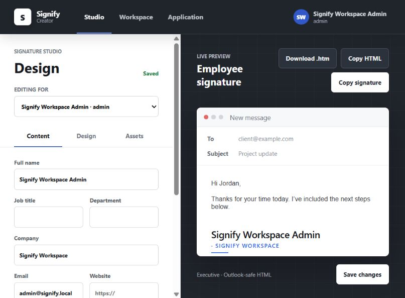

# Signify Creator Guide

Welcome to the complete guide for installing, configuring, and using Signify
Creator.

Signify Creator is a self-hosted web application for building professional email
signatures, managing organization-wide branding, running banner campaigns, and
delivering signatures through Microsoft 365.

## Start Here

Choose the guide that matches what you need to do:

| I want to...                                                     | Open this guide                                       |
| ---------------------------------------------------------------- | ----------------------------------------------------- |
| Install Signify on a Node.js web host, VPS, or Docker server     | [Installation](Installation.md)                       |
| Set the domain, storage, email, Microsoft 365, or updates        | [Configuration](Configuration.md)                     |
| Create signatures, templates, banners, campaigns, and users      | [Using Signify Creator](Using-Signify-Creator.md)     |
| Manage licensing, workspaces, backups, updates, jobs, and audits | [Application Owner Guide](Application-Owner-Guide.md) |
| Diagnose a setup, login, integration, update, or storage problem | [Troubleshooting](Troubleshooting.md)                 |

## What Signify Creator Includes

- A visual, Outlook-friendly signature editor
- Reusable signature templates and company branding
- Employee profile and signature management
- Custom banner creation and campaign scheduling
- QR codes, contact cards, social links, and branded assets
- Microsoft 365 directory synchronization and signature delivery
- Direct user creation and optional email invitations
- Approval workflows, click tracking, and campaign reporting
- GitHub release checks and managed updates
- Backups, restoration, activity history, and operational health checks
- Three levels of access: Application Owner, Tenant Admin, and End User

## Editions

### Community Edition

Every new installation begins in Community Edition. No license key is required.

- One organization workspace
- Up to 10 users
- Signature editor, templates, banners, and campaigns
- Microsoft 365 support for the installation's organization
- Backups, updates, and normal workspace administration

Community Edition does not show multi-tenant controls or Stripe settings.

### Enterprise Edition

Enterprise is activated by entering a license key under **Application >
Licensing**.

Depending on the signed license, Enterprise can provide:

- Multiple customer or department tenants
- Higher user limits
- Cross-tenant administration and reporting
- Enterprise tenant billing through Stripe

The Signify License Authority is operated privately by the product owner. It is
not included with customer installations and is not offered for sale.

## Access Levels

| Access level          | Intended user                                        | Main responsibilities                                                                                  |
| --------------------- | ---------------------------------------------------- | ------------------------------------------------------------------------------------------------------ |
| **Application Owner** | The person responsible for the complete installation | Licensing, tenants, integrations, updates, backups, application owners, jobs, and global audit history |
| **Tenant Admin**      | An administrator for one organization                | People, templates, campaigns, Microsoft 365 connection, branding, approvals, and workspace settings    |
| **End User**          | An employee or signature editor                      | Edit permitted profile fields, preview a signature, and use assigned templates                         |

Application Owners can also belong to a workspace, but application-level access
is separate from tenant membership.

## The Main Areas

### Studio

The Studio is the day-to-day signature editor. It provides content, design, and
asset controls alongside a live email preview.

### Workspace

The Workspace area is where Tenant Admins manage employees, templates,
campaigns, branding, Microsoft 365, approvals, and settings.

### Application

The Application area is reserved for Application Owners. It contains licensing,
integrations, tenants, updates, backups, background jobs, usage, and audit tools.

## Recommended First-Day Checklist

1. Complete the [installation](Installation.md) and first-time setup.
2. Sign in as the first Application Owner and enroll MFA.
3. Open the Studio and save one test signature.
4. Add a Tenant Admin or employee from **Workspace > People**.
5. Create a reusable template.
6. Add a banner and test a campaign.
7. Connect transactional email if you want email invitations and password reset.
8. Connect Microsoft 365 in a test tenant before using production mailboxes.
9. Create a backup and move a copy off the application server.
10. Review **Application > Updates & backups** and **Application > Audit**.

## Important Safety Rules

> [!IMPORTANT]
> Always use HTTPS in production. Keep the database, uploaded media, generated
> banners, and backups on persistent storage.

> [!WARNING]
> Never place passwords, setup tokens, Microsoft secrets, Stripe keys, GitHub
> tokens, or encryption keys in screenshots, issue reports, or source control.

> [!CAUTION]
> Do not run multiple Signify web servers against the same SQLite database. One
> web process and one worker are supported until the runtime is fully moved to
> PostgreSQL.

## Getting Help

Use the [Troubleshooting guide](Troubleshooting.md) first. For a verified product
problem, open a GitHub issue without including credentials or customer data.

- [Latest release](https://github.com/ithealthtech/Signify-Suite/releases/latest)
- [Report a problem](https://github.com/ithealthtech/Signify-Suite/issues)
- [Security policy](../../SECURITY.md)
