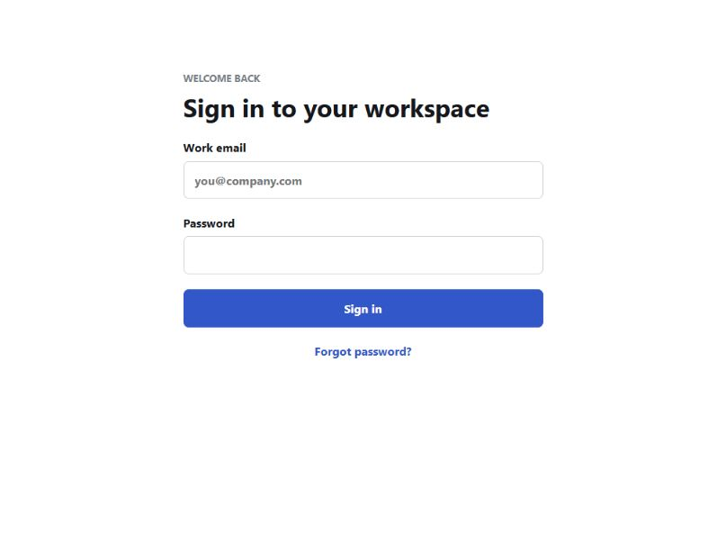

# Using Signify Creator

This guide covers normal day-to-day work in the Studio and Workspace areas.

[Home](Home.md) | [Configuration](Configuration.md) | [Application Owner Guide](Application-Owner-Guide.md)

## Sign In

1. Open your Signify address, such as `https://signatures.example.com`.
2. Enter your work email and password.
3. Complete multi-factor authentication when required.



After signing in, the top navigation shows the areas available to your account:

- **Studio** for creating and previewing signatures
- **Workspace** for organization administration
- **Application** for Application Owners

## Studio Overview


The Studio is divided into two main areas:

- The left side contains employee selection and editing controls.
- The right side shows a live email preview and signature actions.

### Choose an Employee

Tenant Admins and permitted editors can use **Editing for** to select an employee.
End Users normally see their own profile.

The employee selector does not change tenant access. Users can only load records
permitted by their server-side role.

### Content Tab

Use the Content tab for identity and contact information:

- Full name
- Job title
- Department
- Company
- Email address
- Website
- Direct phone
- Mobile phone
- Address
- Social profile links

Example employee information:

```text
Full name: Jordan Lee
Job title: Client Success Manager
Department: Customer Experience
Company: Example Company
Email: jordan.lee@example.com
Direct phone: (555) 010-1200
Website: https://www.example.com
```

Use complete web addresses beginning with `https://` for websites and social
profiles.

### Design Tab

Use the Design tab to select a preset and apply permitted visual settings. The
available options can include:

- Signature layout or template
- Brand colors
- Font family and text appearance
- Spacing and alignment
- Profile image treatment
- Social icon appearance
- Contact card and QR-code options

The preview is visual, but the saved output is generated as email-safe HTML.
Signify uses table-based layout and compatibility techniques where needed so the
result remains usable in Outlook.

### Assets Tab

Use the Assets tab to add or select:

- Employee profile image
- Company logo
- Campaign banner
- Other approved workspace media

Use clear PNG, JPEG, WebP, or GIF assets that are appropriate for email. Avoid
very large source files. Tenant media limits are controlled by the Application
Owner.

### Contact Card and QR Code

Enable **Add contact card** to include a QR code and downloadable vCard when the
selected design supports it.

Before using this feature widely:

1. Confirm the public Signify address uses HTTPS.
2. Scan the QR code from another device.
3. Download the contact card.
4. Confirm the name, company, phone, and email are correct.

### Preview the Signature

The preview places the signature in a sample email so you can judge:

- Overall width
- Text size and hierarchy
- Logo and profile image quality
- Banner proportions
- Mobile readability
- Spacing around the message body

Always send a real test message through the intended mail client before a broad
rollout.

### Save and Export

Available actions can include:

- **Save changes** saves the employee signature to the workspace.
- **Copy signature** copies a version intended for pasting into supported email
  clients.
- **Copy HTML** copies the generated HTML source.
- **Download .htm** downloads an HTML file for manual deployment or testing.

After saving, refresh the page and reopen the employee to confirm the changes
were stored.

## Templates

Templates keep signatures consistent across employees and departments.

### Create a Template

1. Open **Workspace > Templates**.
2. Select **Create template**.
3. Enter a clear name, such as `Corporate Standard` or `Sales Team`.
4. Choose the base layout.
5. Apply brand colors, font, logo, social links, and default options.
6. Save the template.
7. Preview it with more than one employee profile.

### Recommended Template Naming

```text
Corporate Standard
Executive Banner
Sales Campaign
Support Team Compact
Holiday Campaign 2026
```

Avoid names such as `Test 2`, `New`, or `Final Final` because they are difficult
to manage later.

### Update a Template Safely

1. Create or download a backup before a large change.
2. Test the edit with one employee.
3. Preview long names, long titles, and missing phone numbers.
4. Test in Outlook desktop, Outlook web, and a mobile mail client.
5. Use the rollout tools only after the preview is approved.

## People and User Accounts

Open **Workspace > People** to manage workspace members.

### Add a User Directly

Direct creation does not require email delivery.

1. Select **Add user**.
2. Enter the person's name and email.
3. Choose the role.
4. Enter optional profile information.
5. Create the account.
6. Provide the temporary password securely.
7. Ask the user to sign in and change it.

### Invite a User by Email

Email invitations require transactional email.

1. Select **Invite user**.
2. Enter the email address.
3. Choose the role.
4. Send the invitation.
5. Confirm the invitation is accepted before its expiration time.

### Roles

| Workspace role     | Typical use                                                                        |
| ------------------ | ---------------------------------------------------------------------------------- |
| Admin              | Manages people, templates, campaigns, Microsoft 365, and workspace settings        |
| Editor             | Creates and updates permitted signatures and content                               |
| Viewer or End User | Views or edits only the profile and signature capabilities assigned to the account |

Use the least powerful role that allows the person to do their job.

### User Capacity

Community Edition allows up to 10 users in its single workspace. Pending
invitations reserve capacity so the limit cannot be bypassed by creating both an
invitation and a direct account for the same remaining slot.

If the workspace reaches its limit, deactivate or remove an unused member, or
activate a license with additional capacity.

## Banners

Banners can be uploaded, generated, stored in the banner repository, and added to
signatures or campaigns.

### Add a Banner

1. Open the banner or asset area in Workspace.
2. Upload an image or open the banner creator.
3. Choose the banner dimensions.
4. Add overlay text when needed.
5. Set font, size, weight, alignment, and color.
6. Choose an animation effect for supported output.
7. Save the banner to the repository.

Keep text away from the image edges. Verify that animation does not change the
banner's final displayed dimensions.

### Banner Example

```text
Name: Fall Security Review
Headline: Schedule Your 2026 Security Review
Action text: Book a Consultation
Destination: https://www.example.com/security-review
```

Use a meaningful banner name so campaign creators can find it later.

## Campaigns

Campaigns apply a banner to signatures for a defined period.

### Create a Campaign

1. Open **Workspace > Campaigns**.
2. Select **Create campaign**.
3. Enter the campaign name.
4. Choose a saved banner from the banner repository.
5. Enter the destination address for tracked clicks.
6. Select the start and end dates.
7. Choose the intended audience or scope.
8. Review the banner preview.
9. Save the campaign.

Cancel and close controls do not require completed form fields. No campaign is
created until the save action succeeds.

### Campaign Status

| Status    | Meaning                                |
| --------- | -------------------------------------- |
| Draft     | Saved but not active                   |
| Scheduled | Waiting for the start date             |
| Active    | Eligible signatures display the banner |
| Ended     | The end date has passed                |

### Test a Campaign

1. Use a test banner and short test date range.
2. Assign it to a test employee or small group.
3. Open the signature preview.
4. Confirm the banner is not enlarged or cropped.
5. Click the banner and confirm the destination.
6. Check campaign reporting for the tracked click.
7. Disable or end the test campaign.

## Microsoft 365 Directory Synchronization

After a Tenant Admin connects Microsoft 365:

1. Open the Microsoft 365 or directory area in Workspace.
2. Start a directory synchronization.
3. Wait for the background job to complete.
4. Review discovered users.
5. Approve, invite, or manage users according to workspace policy.

Synchronization is tenant-scoped. One workspace cannot read another workspace's
directory data.

## Signature Rollout

Use rollout tools after the template, employee data, and Microsoft 365 connection
have been tested.

1. Select the template and target users.
2. Review the rollout summary.
3. Start the rollout.
4. Monitor the background job.
5. Review failures instead of immediately retrying everything.
6. Correct the root cause and retry only affected work.

Managed signatures are removed or disabled when the member or Enterprise tenant
subscription is inactive, then resume when entitlement is restored.

## Approvals

When approval is enabled, submit signature changes for review rather than
publishing them immediately.

Reviewers should verify:

- Identity and contact information
- Company name and job title
- Brand colors and logo
- Website and social destinations
- Banner campaign and dates
- Mobile and Outlook rendering

Approval actions are recorded so the workspace has an activity history.

## Daily Usage Checklist

- Confirm recently changed signatures display correctly.
- Review pending invitations and approvals.
- Check active campaign dates and destinations.
- Review failed Microsoft or rollout jobs.
- Remove outdated banners and test records when no longer needed.
- Avoid uploading duplicate or oversized media.

For application-wide maintenance, continue with the
[Application Owner Guide](Application-Owner-Guide.md).
